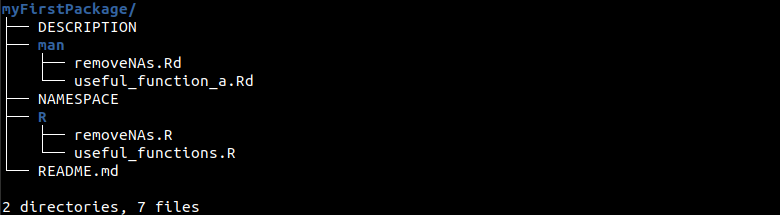
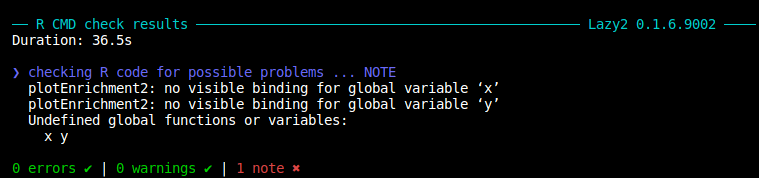

This part mostly follows [this guide](https://hilaryparker.com/2014/04/29/writing-an-r-package-from-scratch/), with some minor additions by myself.

## Why create custom R package?


<br>

## Step 0. Required packages

Two packages are required before building : `devtools`, `roxygen2`

```R
install.packages("devtools")
devtools::install_github("klutometis/roxygen")

library(devtools)
library(roxygen2)
```

- `devtools` provides functions for creating the base structure and building the packages, for example, `build()`, `check()`.
- `roxygen2` is for documentation and makes it easy to create manual pages from R script files.

<br>

## Step 1. Package creation

Devtools `create` function will make the base template for the package. Note the working directory, which is the directory where you want your package files to be set up.

```R
library(devtools)
setwd("parent_dir")
create("myFirstPackage")
```

This will create a new directory `myFirstPackage` under `parent_dir`, or turn an empty `myFirstPackage` directory into an empty R package. If the directory is not empty, R will throw an error. Inside `myFirstPackage`, we now have two files `DESCRIPTION`, `NAMESPACE`, and an `R` directory.

This is how it should look like:

```
myFirstPackage/
├── DESCRIPTION
├── NAMESPACE
└── R

1 directory, 2 files
```

`DESCRIPTION` is where the package's, well, description goes, and the file has information such as package version, title, authors, and license. This is also where you can add package dependencies. `R` directory is where all the R scripts containing the package functions and data will go. We do not have to worry about `NAMESPACE` as roxygen will handle that.

<br>

### **Optional step. Git Initialize**

To version control with git and make our new package into one that can be installed through devtools' `install_github` function, we need to initialize a git repository before going any further. If you're not interested in using GitHub, skip this and move on to Step 2.

```sh
# Git initialize
cd ./myFirstPackage
git init

# create the remote repository of same name at Github

# add remote 
git remote add origin git@github.com:LittleHeronCodes/myFirstPackage.git

# pull
git pull origin main --allow-unrelated-histories

# set branch upstream
git branch --set-upstream-to=origin/main master

# commit and push
git add .
git commit -m 'Initial commit'
git push
```

For some reason the default branch in local repo is `master` for my machine, while GitHub has changed the default branch name into `main` due to the negative connotations of the word 'master'. This causes problems when pushing local changes to remote.

<details>

```sh
$ git push
fatal: The upstream branch of your current branch does not match
the name of your current branch.  To push to the upstream branch
on the remote, use

    git push origin HEAD:main

To push to the branch of the same name on the remote, use

    git push origin HEAD

To choose either option permanently, see push.default in 'git help config'.
```

</details> <br>

While it is possible to solve this, to save myself from future headaches I'm just changing the name so they match. If this is not a problem you can skip this part.

```sh
git branch -m master main
git push
```

When creating the repository, it is recommendable to create both `.gitignore` and `README.md` file. `.gitignore` contains the list of files that would not be pushed to git. There is a template for R we can use when creating the file on GitHub which tells git to ignore tar build files so the repository does not get unnecessarily bloated.

<br>

## Step 2. Writing functions

Now we need to populate our package with functions. Function scripts go under `R/` directory.

```R
# R/removeNAs.R
# removeNAs from a vector
removeNAs <- function(x) {
    x[which(!is.na(x))]
}
```

Functions can each have their own file or several can be put together in a single file. Some say it is better to have one function for one script file. I personally tend to categorize functions so I don't end up with dozens of R scripts that are only maybe 10 lines long, but this is a matter of preference.

Next, we write documentations for our functions and this is where `roxygen2` comes in. Adding special comments before the function and `roxygen2` will compile them to separate documentations later during package build. The documentations written here will later show up as help page for each function.

```R
#' removeNAs   <- this is the title
#'
#' Remove NA values from a vector  <- this is the description
#' Descriptions can be both single or multi-line.
#' Like
#' this
#'
#' @param x input vector
#' @return NA removed vector
#' @export
#' @examples
#' a <- c(1, 2, 3, NA, 6, NA, 7)
#' removeNAs(a)
removeNAs <- function(x) {
    x[which(!is.na(x))]
}

```

The first line is the title. The second section is for description and this can be put in multiple lines. Next we have tags for `roxygen2` to parse.

These are the most basic tags:

- `@param` : List and explain parameters, or options given in functions.
- `@return` : Description of the value returned by the function.
- `@examples` : Provide example of how to use the function.
- `@export` : Tag to indicate whether the function should be exported into the namespace, indicated in the `NAMESPACE` file. 

### One note on the example

Examples will actually be run upon build and return an error if it cannot be run as-is. Either create all the variables properly as the example given above or use a `dontrun` wrapper like this:

```R
#' \dontrun{
#' removeNAs(vector_with_na_values)
#' }
```

Sometimes, functions have similar use and share parameters, so it would be help everyone's sanity to put them together in the help page. We can use `@describeIn` for this:

```R
#' Useful function A
#'
#' Description of Useful function A
#'
#' @param x input 
#' @return print I am a useful function
#' @export
#' 
useful_function_a <- function(x) {
	print("I am a useful function!")
}

#' @describeIn useful_function_a
#' Useful function B
#' @export
#' 
useful_function_b <- function(x) {
	print("I am also a useful function!")	
}

```

Calling `??useful_function_b` will now call the help from `useful_function_a` and show the manual for both.

<br>

## Step 3. Process documentation

Creating the documentation is simple. Again, note the working directory :

```R
library(devtools)
setwd("./myFirstPackage")
document()
```

Now the package directory will look like this, where we have `man` directory where all the manual Rd files are:

```
myFirstPackage/
├── DESCRIPTION
├── man
│   ├── removeNAs.Rd
│   └── useful_function_a.Rd
├── NAMESPACE
├── R
│   ├── removeNAs.R
│   └── useful_functions.R
└── README.md

2 directories, 7 files

```


We can also test build check if everything works fine by running `check` which will run `R CMD`. Incidentally, this was the result of check for my personal function package Lazy2:



<br>

## Step 4. Install

Finally, we can install the package using devtools `install`.

```R
# install from package directory
setwd("./myFirstPackage")
install()

# install from different directory
setwd("~")
install("path/to/myFirstPackage")
```

If you have done the optional step and hosted the package as a git repository, commit/push to remote and now you can install your new shiny package directly from github.

```R
library(devtools)
install_github("github_username/myFirstPackage")
```

Congratulations, we now have a working R package!

<br>

## Step 5?

Now that we have the basics of the package, for personal use this is really all we need. However, there are still plenty stuff that we can do. For example, we can put data in for quick load, and this is in fact one of the biggest reasons I built the Lazy2 package out of my custom functions--because I did not want to constantly look up where I put the most recent gene name mapping file. Also, once you start putting in a bunch of functions together, `check` will start complaining about dependencies, unbound variables (as seen in the example above), which can become a nuisance later.

The next post will cover how to add datasets for easy load, managing package dependencies, and a couple additional tricks.

